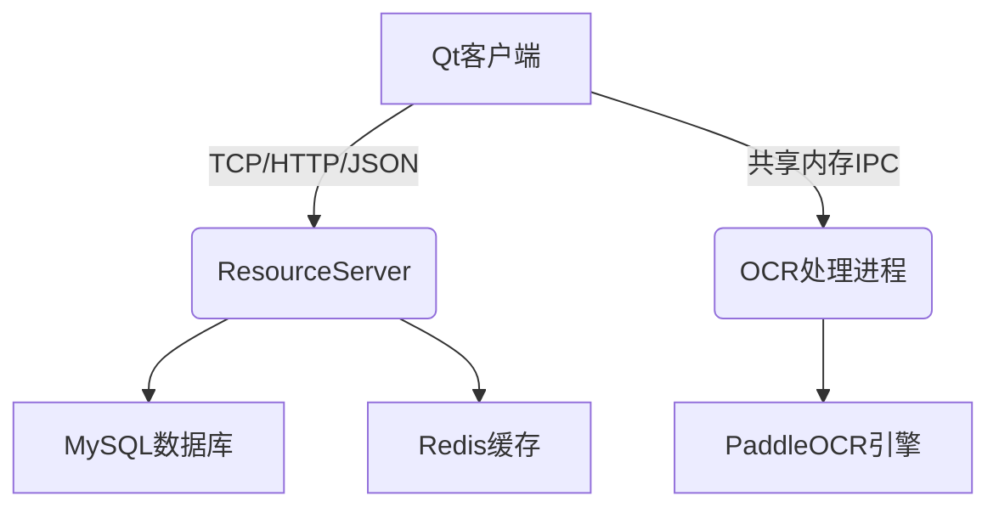

# GreatScanner - 多功能文档处理工具  

 `📅 最后更新: 2025年7月31日 |  🐍 当前版本: 1.0.0`  

   

##  🌟 项目概述

一个集OCR识别、文档转换、云备份于一体的生产力工具，采用C++/Qt开发客户端，基于ASIO的高性能服务端架构，支持： - 图片文字提取（中英文混合识别） - 文档格式转换（Word/PDF/Excel) - 截图即时OCR  - 本地->云端历史记录同步  - 搜索功能

代码约为15000行

## 开发历程与致谢

###  🛠️ 当前进展

核心功能开发已进入收尾阶段，但受限于以下因素仍在持续优化：

1. ***\*开发环境局限\****     - 全程基于Windows平台开发，部分跨平台兼容性体验较差     - 早期代码结构存在技术债务，需边开发边重构  
2.  ***\*能力成长曲线\****     - 初期编码能力不足（现在仍有提升空间）     - 部分代码风格明显受B站UP主([恋恋风辰zack的个人空间-恋恋风辰zack个人主页-哔哩哔哩视频](https://space.bilibili.com/271469206?spm_id_from=333.337.0.0)) 影响    

### 🙏 特别鸣谢

后端架构主要学习自***\*llfc\***前辈的公开技术分享：   - 其开源项目为爱发电的精神深刻影响了本项目   - 关键技术方案（如ASIO线程池、MySQL连接池等）均借鉴自其工程实践    *> 注：代码中若发现风格跳跃或重构痕迹，正是开发者技术成长的见证  🌱*


## 技术架构




## ✨ 核心功能

### 客户端功能

- OCR识别系统
    - 基于PaddleOCR的本地化识别引擎
    - 共享内存IPC进程通信架构
    - 支持截图即时识别（Alt+S快捷键触发）
- 文档转换
    - 图片转Word（自动排版）
    - 图片转PDF（带水印功能）
    - 图片转Excel（表格识别）
- 用户系统
    - 邮箱验证注册/登录

### 服务端特性

- 双IO池架构
    - 独立线程池处理TCP文件传输和HTTP请求
    - 基于ASIO的异步IO上下文池
- 数据层
    - MySQL连接池（支持事务）
    - Redis缓存验证码
    - 异步BCrypt哈希计算
- 智能搜索
    - 中文分词（cppJieba库集成）
    - Trie树前缀匹配
    - 多维度排序算法


## 📦 模块结构

```
GreatScanner/
├── QtClient/                # Qt客户端 
│   ├── core/                # 核心模块 
│   │   ├── ipc/             # 进程通信 
│   │   ├── search/          # 搜索引擎 
│   │   └── utils/           # 工具类
│   ├── pages/               # 界面模块
│   └── resources/           # 资源文件 
├── server/                  # 服务端 
│   ├── asio_pool/           # IO线程池
│   ├── dao/                 # 数据访问层 
│   └── services/            # 业务逻辑 
└── ocr_system/              # OCR处理模块
```


## 编译要求

- Qt 6.5+ (客户端)
- C++20 (服务端)
- OpenCV 4.5+
- PaddleOCR 2.5+


## 未来计划

- 公式识别
- 证件扫描
- 性能优化